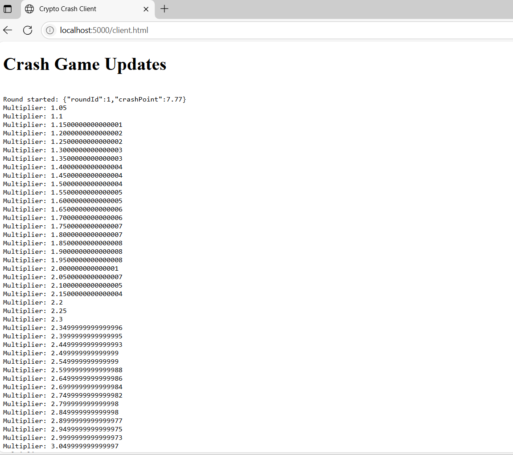

# 🧨 Crypto Crash Game (Backend)

An online real-time multiplayer crash game where players bet in USD, converted to crypto, and try to cash out before the multiplier crashes.

## live ("https://crypto-crash-game-nvw3.onrender.com/client.html")
- **gamelive**  "https://crypto-crash-game-nvw3.onrender.com/client.html"
- **postman get cash**  "https://crypto-crash-game-nvw3.onrender.com/api/wallet/uday1"

- **postman post addcash**  "https://crypto-crash-game-nvw3.onrender.com/api/wallet/add"
            {
                 "userId": "uday1",
                 "currency": "BTC",
                "amount": 10
            }
- **postman post bet**  "https://crypto-crash-game-nvw3.onrender.com/api/game/bet"
                {
                  "userId": "uday1",
                  "usdAmount": 15,
                     "currency": "BTC"
                }

- **postman post cashout**  "https://crypto-crash-game-nvw3.onrender.com/api/game/cashout"
                {
                    "userId": "uday1",
                     "multiplier": 2,
                     "cryptoAmount": 0.0013384696096599227,
                     "currency": "BTC"
                }


## 📄 Problem Statement

<a href="https://github.com/UdayRaj04/crypto-crash-game/blob/main/sixtynine assignment.pdf" target="_blank">
  
</a>


---

## 🚀 Features

- Real-time **multiplier growth and crash**
- Provably fair crash point generation
- **Crypto price conversion** using CoinGecko API
"https://api.coingecko.com/api/v3/simple/price?ids=bitcoin,ethereum&vs_currencies=usd"
- USD ↔ BTC/ETH conversion
- Wallet system with balance tracking
- Real-time updates via **Socket.IO**
- REST API for placing bets, cashouts, checking balances , add balances
- MongoDB (Atlas ready)

---

## ⚙️ Tech Stack

- Node.js + Express
- Socket.IO (WebSockets)
- MongoDB + Mongoose
- CoinGecko API
- Crypto module for secure randomness

---

## 📦  See Game Live   **LOCAL MACHINE**

- http://localhost:5000/client.html

 

## 📦 get cash

 


## 📦 post addcash

 

## 📦 post bet


## 📦 post cashout


## 📦 Installation
- change  in .env
- MONGO_URI=   your mongodburl

```bash
git clone https://github.com/yourusername/crypto-crash-game.git
cd crypto-crash-game
npm install
npm run dev
---


