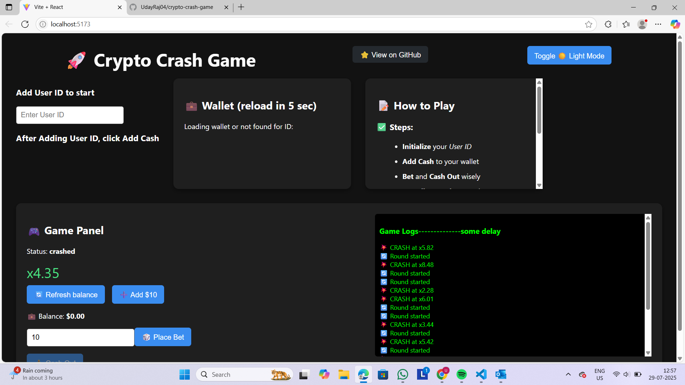
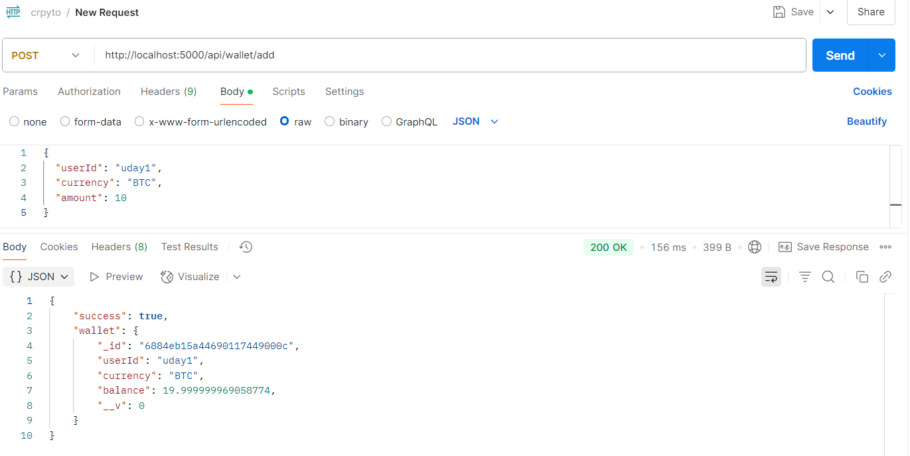
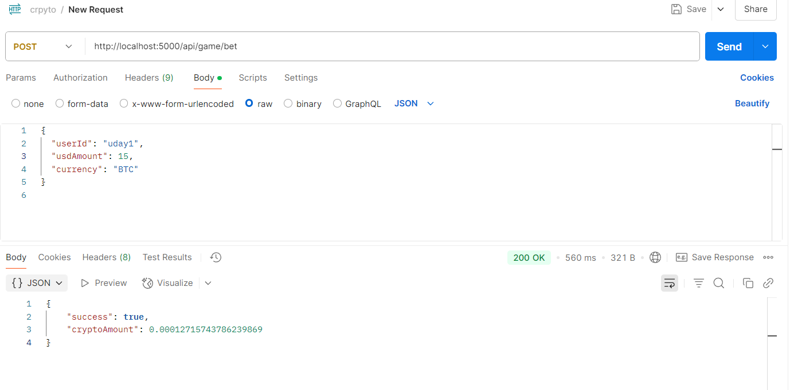
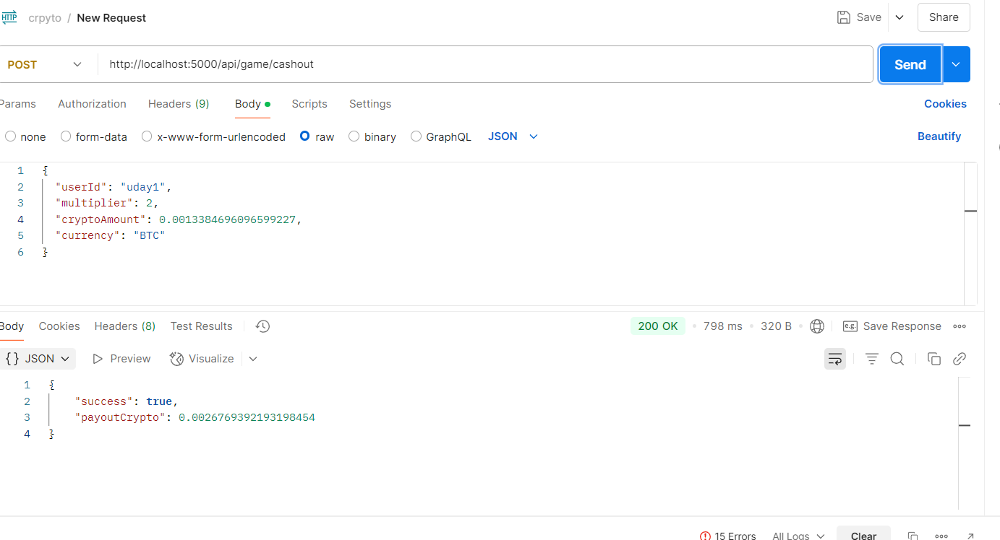

# 🧨 Crypto Crash Game (Backend)

An online real-time multiplayer crash game where players bet in USD, converted to crypto, and try to cash out before the multiplier crashes.

## 🔗 Live Links
- **Frontend Live**: [https://crypto-crash-fjy8.onrender.com](https://crypto-crash-fjy8.onrender.com)

- **Backend Live**: [https://crypto-crash-game-nvw3.onrender.com](https://crypto-crash-game-nvw3.onrender.com)


## 📄 Problem Statement

<a href="https://github.com/UdayRaj04/crypto-crash-game/blob/main/sixtynine assignment.pdf" target="_blank">
  
</a>


---

## 🎮 How It Works

1. Players place a bet in USD.
2. The multiplier starts increasing (e.g., 1.01x, 1.50x, etc.).
3. Cash out before the crash to win based on the current multiplier.
4. If the multiplier crashes before you cash out, you lose the bet.

---

## ✨ Features

- 🪙 Real-time crypto wallet (with USD & BTC)
- ⚡ Live multiplier updates via WebSocket
- 💰 Bet & Cash Out functionality
- 📊 Game logs and history
- 🌓 Light/Dark Mode toggle
- 🔄 Auto wallet refresh every 5 seconds

---

## 🧱 Tech Stack

| Frontend        | Backend         | Database     | Realtime       |
|----------------|------------------|--------------|----------------|
| React (Vite)   | Node.js + Express| MongoDB Atlas| Socket.IO      |

---

## ⚙️ API Endpoints
### Wallet Operations
**Get Balance**  
`GET /api/wallet/:userId`  
Example: [https://crypto-crash-game-nvw3.onrender.com/api/wallet/uday1](https://crypto-crash-game-nvw3.onrender.com/api/wallet/uday1)

- **postman post addcash**  "https://crypto-crash-game-nvw3.onrender.com/api/wallet/add"
            {
                 "userId": "uday1",
                 "currency": "BTC",
                "amount": 10
            }
- **postman post bet**  "https://crypto-crash-game-nvw3.onrender.com/api/game/bet"
                {
                  "userId": "uday1",
                  "usdAmount": 15,
                     "currency": "BTC"
                }

- **postman post cashout**  "https://crypto-crash-game-nvw3.onrender.com/api/game/cashout"
                {
                    "userId": "uday1",
                     "multiplier": 2,
                     "cryptoAmount": 0.0013384696096599227,
                     "currency": "BTC"
                }


## 📦 Installation

### 🔧 1. Clone the Repository
```bash
git clone https://github.com/yourusername/crypto-crash-game.git
cd crypto-crash-game
--- 
### 2. Configure Environment Variables
Create a .env file in the root directory: and add
MONGO_URI=your_mongodb_connection_string


## 📦 Installation
- change  in .env
- MONGO_URI=   your mongodburl

```bash clone
git clone https://github.com/yourusername/crypto-crash-game.git
---

```bash backend
cd crypto-crash-game
npm install
npm run dev
---

```bash Frontend in new terminal
cd frontend
npm install
npm run dev
--


## 📦  See Game Live   **LOCAL MACHINE**

-  backend live --  http://localhost:5000
- Frondend live -- http://localhost:5173


 

## 📦 get cash

 


## 📦 post addcash

 

## 📦 post bet



## 📦 post cashout




